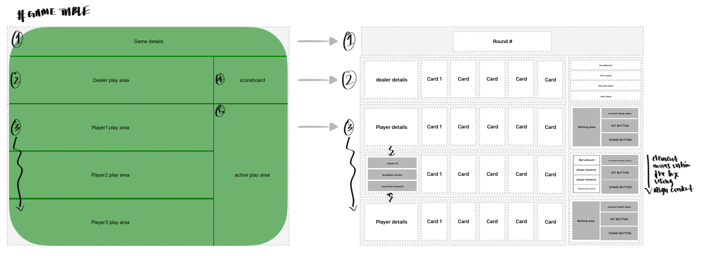
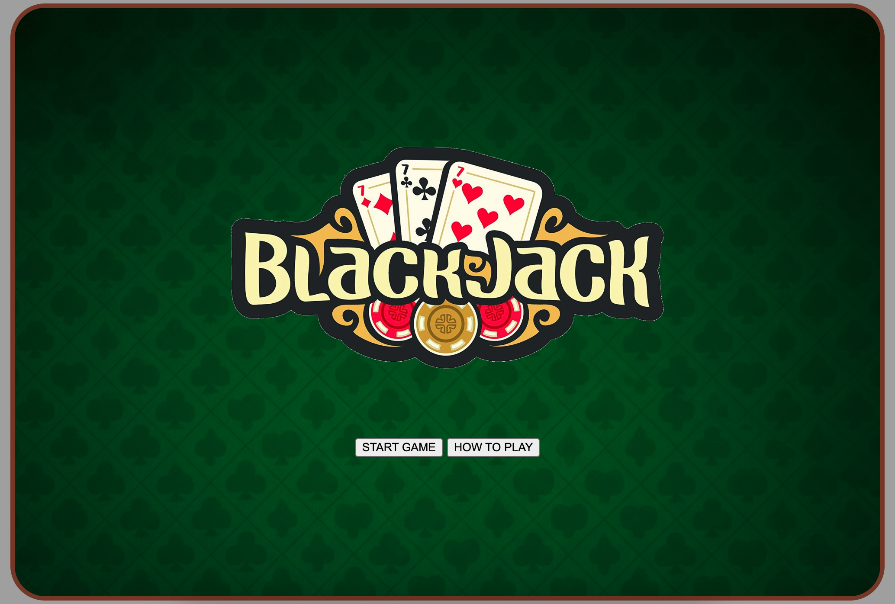
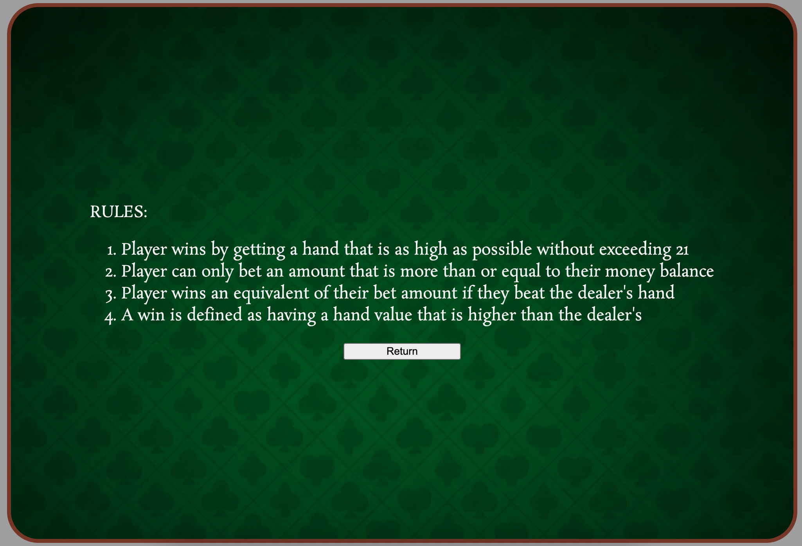
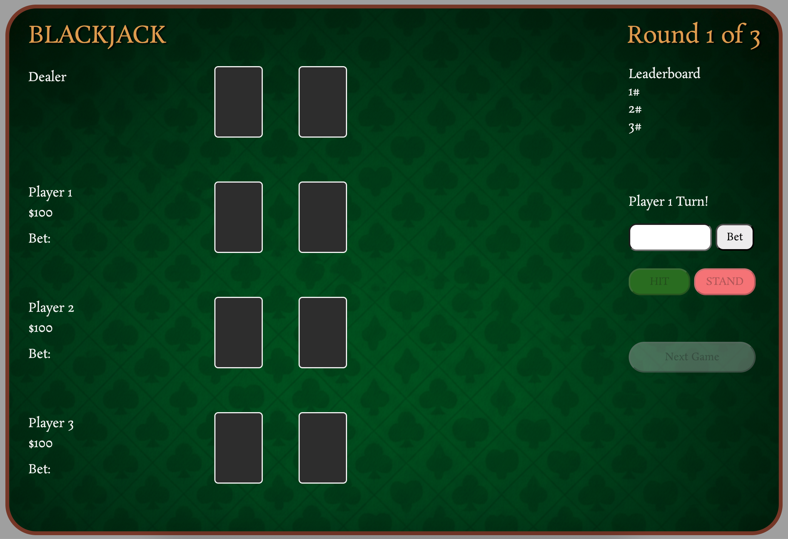
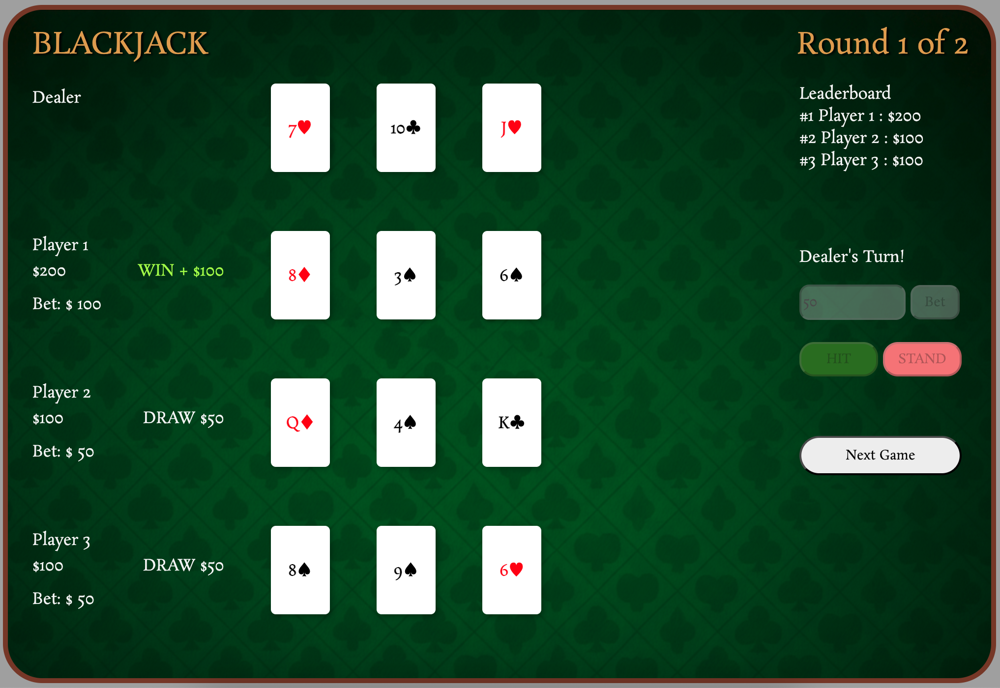
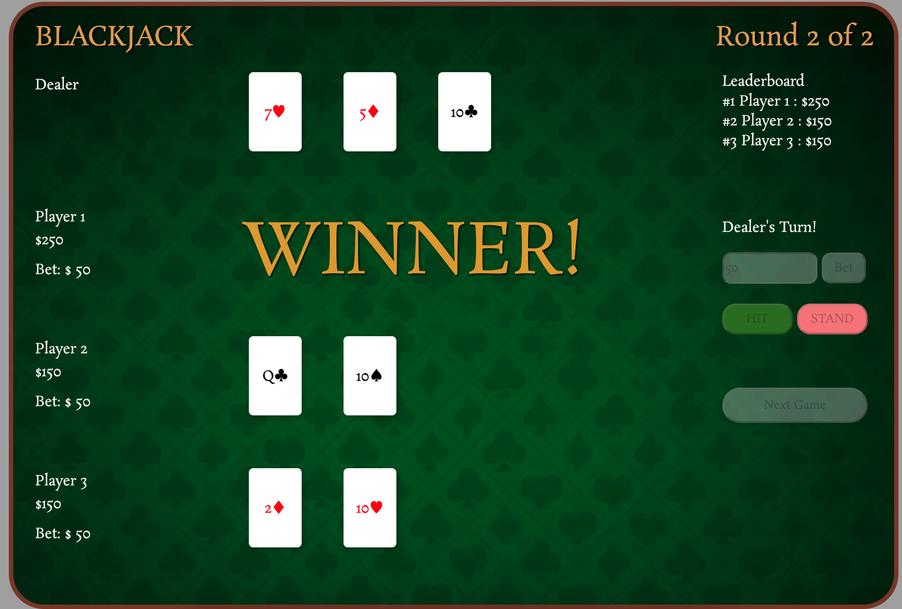

# Project 1: Building a Web-based Browser Game

## Background and Context : Why Blackjack?

Blackjack (or "Ban Luck" as we would call it here in Singapore), is a game that remind me of my childhood. Growing up in a large family, I was used to spending my weekends at my grandparents' place with my many cousins. As we all grew up and got on with our own lives, we all started drifting apart. Chinese New Year is the singular occasion where we get to gather like old times. At this gathering, we would always play Blackjack as a means to pass time. Playing the game reminds of simpler times back during my childhood where we get to laugh amongst each other.

## Designing the game

### User Stories

This game was developed with these user stories in mind:

- User must be able to place hit/stand and place bets
- User must be able to see outcome of hand at the end of dealer's turn
- User must be able to see scoreboard at any given point of time
- At the end of game, user must know which player won the game

### Wireframe design

### Screengrabs of game

1. Start Page
   

2. How To Play Page
   

3. Game
   
   
   

## Technologies Used

- JS
- HTML
- CSS
- Bootstrap JS
